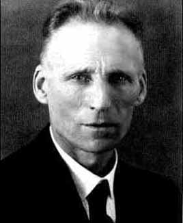

## A matemática foi descoberta ou inventada?

  

    <figure><figcaption>Platão (séc. IV a.C.)</figcaption></figure>
  

  
vs

  

    <figure><figcaption>L.E.J. Brouwer (1907)</figcaption></figure>
  

 <!-- .element: class="fragment" -->
---

| Platonismo  | Intuicionismo |
| :--------: |:-------------:|
| A matemática foi descoberta                     <!-- .element: class="fragment" -->       | A matemática foi inventada                         <!-- .element: class="fragment" --> |
| A matemática existe independente do ser humano  <!-- .element: class="fragment" -->       | A matemática existe só na mente humana           <!-- .element: class="fragment" --> |
| A verdade matemática é objetiva                 <!-- .element: class="fragment" -->       | A verdade matemática é uma experiência subjetiva <!-- .element: class="fragment" --> |

Pergunta: que diferença isso faz? <!-- .element: class="fragment" -->

---

No intuicionismo, só podemos afirmar a existência do que podemos construir na nossa mente.

Mas a lógica clássica permite provar coisas <i>não construtivas</i>.
 <!-- .element: class="fragment" data-fragment-index="1"-->

<small>(ou seja, provar existência de um objeto matemático que não construímos em nossa mente.)</small> <!-- .element: class="fragment" data-fragment-index="1" -->

---

Exemplo: Em 1949, John Nash provou que o primeiro jogador no jogo de Hex tem uma estratégia pra sempre vencer.

Mas até hoje ninguém sabe que estratégia é essa!

<small>https://en.wikipedia.org/wiki/Hex_(board_game)</small>

<small>O filme "Uma mente brilhante" (2001) é sobre a vida de John Nash</small>

---

A prova de Nash é uma prova por redução ao absurdo:

<small>
<ol>
<li class="fragment" data-fragment-index="0">Foi provado anteriormente que o jogo nunca pode empatar. (um dos
   dois jogadores tem uma estratégia vencedora)</li> 
<li class="fragment" data-fragment-index="1">Suponha que o segundo jogador tenha uma estratégia vencedora.</li> 
<li class="fragment" data-fragment-index="2">Então o primeiro jogador pode fazer uma jogada qualquer, e adotar a mesma estratégia do segundo jogador.</li> 
<li class="fragment" data-fragment-index="3">Isso contradiz o fato de que o segundo jogador tem uma estratégia para vencer.</li> 
<li class="fragment" data-fragment-index="4">Portanto, o primeiro jogador tem uma estratégia vencedora.</li>
</ol>
</small>

??? que estratégia é essa exatamente?

---

A prova por redução ao absurdo levou o Nash a afirmar a existência de uma
estratégia vencedora mesmo sem ter construído ela em sua mente.

Brouwer queria rejeitar esse tipo de raciocínio, mas ele segue as regras da lógica! <!-- .element: class="fragment" -->

... mas talvez podemos mudar as regras da lógica? <!-- .element: class="fragment" -->

---

| Logicismo  | Intuicionismo |
| :--------: |:-------------:|
| Primeiro veio a lógica, depois a matemática                     <!-- .element: class="fragment" -->       | As regras da lógica foram criadas para refletir nossa intuição matemática                         <!-- .element: class="fragment" --> |
| Os fatos matemáticos se resumem a fatos lógicos <!-- .element: class="fragment" --> | As construções matemáticas não dependem da lógica, e sim de nossa intuição <!-- .element: class="fragment" -->

---

A lógica intuicionista não é a lógica do verdadeiro ou falso, e sim do "posso provar" ou "posso refutar"

---

| Proposição  | Lógica clássica <!-- .element: class="fragment" data-fragment-index="1" -->  | Lógica intuicionista <!-- .element: class="fragment" data-fragment-index="2" -->  |
| :--------: |:-------------:|:-------------:|
| $P$          | P é verdade <!-- .element: class="fragment" data-fragment-index="1" -->               | Posso provar P <!-- .element: class="fragment" data-fragment-index="2" -->              |
| $\neg P$ (não P) <small>(também escrito ~P)</small>        | P é falso <!-- .element: class="fragment" data-fragment-index="1" -->              | Posso refutar P   <!-- .element: class="fragment" data-fragment-index="2" -->             |

---

## Lei do terceiro excluído

Na lógica clássica, $P \lor \neg P$ é uma tautologia

<small>Significa "P é verdade ou P é falso", para qualquer $P$ - não tem uma terceira opção</small>

Mas na lógica intuicionista, tem outro significado: "posso provar P ou posso refutar P" <!-- .element: class="fragment" data-fragment-index="1" -->

Há uma terceira opção! <!-- .element: class="fragment" data-fragment-index="1" -->

---

## Negação intuicionista

Na lógica intuicionista, a negação $\neg P$ é definida como $P \to \bot$

<small>Onde $\bot$, chamado "bottom" ou "absurdo", é uma proposição que nunca pode ser provada.</small>

Afirmar $\neg P$ significa que se, hipoteticamente, pudessemos provar $P$, então teríamos uma prova do absurdo. <!-- .element: class="fragment" -->

Mas isso é o mesmo que <em>refutar</em> $P$!
 <!-- .element: class="fragment" -->

---

## Negação intuicionista

Do mesmo modo, para provar uma negação $\neg P$, tomamos $P$ como hipótese, e a partir daí derivamos um absurdo ou contradição.

Mas isso não é o mesmo que a prova por redução ao absurdo? <!-- .element: class="fragment" -->

<small>Não: quando esse raciocínio é usado pra provar uma proposição negativa, chamamos de "prova de negação" e não "redução ao absurdo"</small> <!-- .element: class="fragment" -->

---

## Redução ao absurdo

Na redução ao absurdo, tomamos $\neg P$ como hipótese e chegamos numa contradição. E daí concluímos que $P$ é verdade.

Mas na lógica intuicionista, esse raciocínio só pode ser usado pra concluir uma negação. Portanto, concluímos apenas $\neg \neg P$. <!-- .element: class="fragment" -->

Mas $\neg \neg P$ não é a mesma coisa que $P$? <!-- .element: class="fragment" -->

Na lógica intuicionista não é! <!-- .element: class="fragment" -->

---

## Dupla negação

Na lógica clássica, $\neg \neg P$ significa "não é verdade que P é falso", e, por conta do terceiro excluído, podemos concluir que $P$ é verdade.

Mas na lógica intuicionista, $\neg \neg P$ significa "não posso refutar P". Mas isso é diferente de provar $P$. <!-- .element: class="fragment" -->

---

## Dupla negação

A partir de $P$ podemos concluir $\neg \neg P$ na lógica intuicionista: se eu posso provar, então eu não posso refutar.

Ou seja, $P \to \neg \neg P$

Mas não podemos concluir $\neg \neg P \to P$, porque o fato de não podermos refutar não é suficiente pra de fato ter uma prova.
 <!-- .element: class="fragment" -->

---

É por isso que a prova por redução ao absurdo não é válida na lógica intuicionista!

Dum ponto de vista intuicionista, Nash apenas provou que não podemos refutar que
o primeiro jogador tem uma estratégia vencedora. <!-- .element: class="fragment" -->

Só podemos afirmar que o jogador de fato tem essa estratégia se pudermos
dizer exatamente no que consiste essa estratégia. <!-- .element: class="fragment" -->

---

## Teorema de Glivenko (tradução da dupla negação)

Se $P$ pode ser provado na lógica clássica, $\neg \neg P$ pode ser provado na lógica intuicionista (e vice versa)

<small>Isso ocorre porque talvez a redução por absurdo possa ter sido usada durante a prova</small>

Ou em outras palavras: <!-- .element: class="fragment" data-fragment-index="1" -->

Se P é verdade na lógica clássica, não podemos refutar P na lógica intuicionista (e vice versa) <!-- .element: class="fragment" data-fragment-index="1" -->

---

## Tradução da dupla negação

Por exemplo: a lei do terceiro excluído $P \lor \neg P$ não pode ser refutada na lógica intuicionista

Ou seja, $\neg \neg (P \lor \neg P)$ é válido intuicionisticamente

---

## Tradução da dupla negação

Podemos interpretar $P \to \neg \neg P$ como "se P pode ser provado na lógica intuicionista, P pode ser provado na lógica clássica", o que está correto

<small>Mas o contrário, $\neg \neg P \to P$ seria "se P vale classicamente, P também vale intuicionisticamente", o que não é o caso</small> <!-- .element: class="fragment" -->

<small>... mas $\neg \neg (\neg \neg P \to P)$, que é "na lógica clássica, podemos eliminar a dupla negação", pode ser provado na lógica intuicionista!</small> <!-- .element: class="fragment" -->

---

A lógica intuicionista é mais expressiva: expressa tanto o pensamento clássico (pela transformação da dupla negação), quanto o intuicionista

E ela nunca contradiz a lógica clássica: apenas diz que não há fundamentos para certos resultados, mas sem os refutar <!-- .element: class="fragment" -->

---
